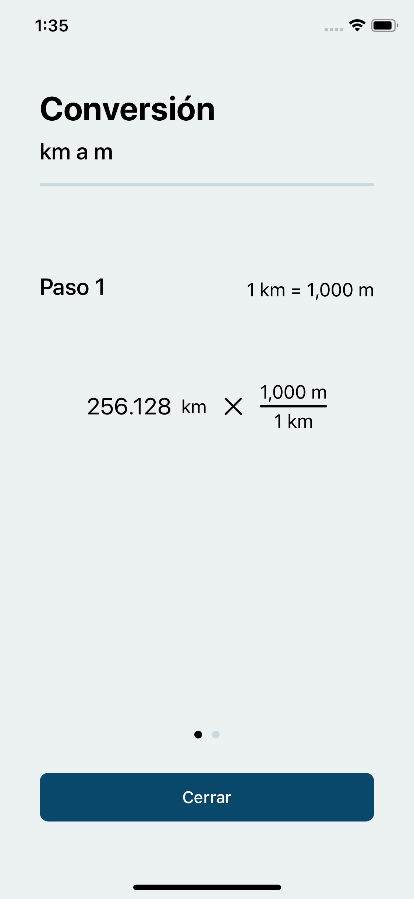

# Unit Conversion iOS app

## Background
A physics professor at our university, Tec de Monterrey, teaches a physics
class online to high school students. He identified that many students where
having difficulties on making sense how the unit conversions where made,
mainly, with compound units. For example, making a conversion from kilometers
per hour to meters per second. He asked us to help him, through an app, show
his students how to make each conversion.

## Screenshots

  
  
  

